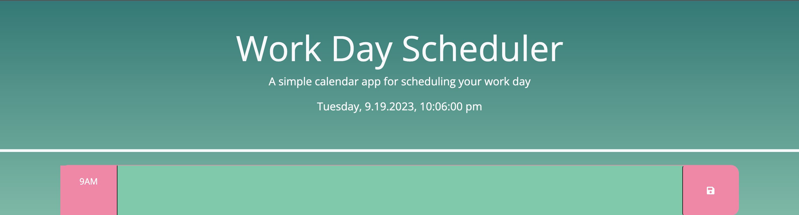

# My Nine-to-Five

## Description
My motivation for this project was to allow the end-user to schedule their day easily with dynamic features that reminded them what time it was and when their scheduled events have passed or are still to come.

This scheduler solves the problem of user entries being erased once they leave the webpage by retaining info via localStorage, and it also solves the problem of keeping track of the day and time, as those are displayed at the top of the page and indicated by a green color scheme, respectively.

In building this, I learned to think "big picture": how to traverse the DOM more precisely while accessing elements in relation to other elements, how to use dayjs to access the date and time and display them in a format that I prefer. Within these learning points, I also learned how to concisely target elements and dynamically add classes to them via a for loop.

## Usage
Upon landing on the page, user will see the display of the current day and time.

In the text entries, they can type whatever event that will occur at the corresponding time block.
Clicking the save button will save this data and persist, so when they come back, whatever they typed in will still be there!

The scheduler will also visually track time for the user too -- 
any events in the hours that have passed will be colored dark green,
any event in the future will be in light green,
and the current hour block will be in bright, pistachio green.

Now the user can schedule events in their dat effectively and efficiently because input will be updated manually by the user and time is constantly tracked and implemented visually with a color scheme.

## Credits
Starter code in HTML, CSS, and JS provided by edX.

In script.js, Learning Assitant Mampuru helped construct line 20

## Deployed Application Link
Please view the deployed scheduler app [here](https://mintyry.github.io/my-nine-to-five/)!